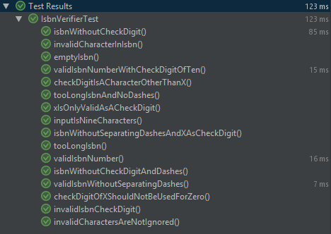
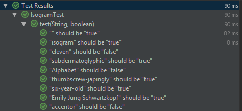

I had to modify the test class for the Isogram task because it used JUnit4 syntax while I had JUnit 5 set up. That and I needed to change the includes for all of the tests to their JUnit5 equivalents.

Made using IntelliJ IDEA.

